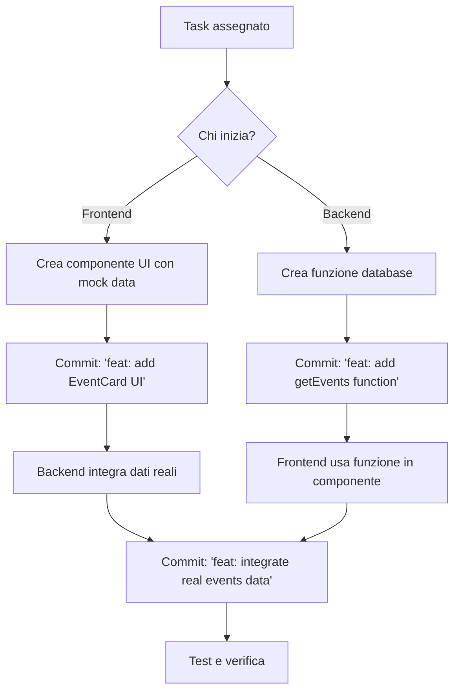

# 🤝 Workflow di Collaborazione Frontend/Backend

Questo documento definisce le convenzioni per la collaborazione tra sviluppatore backend e frontend, minimizzando i conflitti sui file.

## 👥 Divisione Responsabilità

### 🔧 Backend Developer

**File di responsabilità esclusiva:**
- `src/lib/client.ts` - Configurazione client Supabase
- `src/lib/database/**/*.ts` - Tutti i moduli database:
  - `profiles.ts` - Operazioni profili utente
  - `events.ts` - Gestione eventi e partecipazioni
  - `storage.ts` - Upload/delete documenti
  - Altri moduli futuri

**Non toccare:**
- File `.astro` (HTML/CSS)
- `src/styles/**/*`
- `src/scripts/**/*`
- `src/components/ui/**/*`

---

### 🎨 Frontend Developer

**File di responsabilità esclusiva:**
- `src/components/ui/**/*.astro` - Tutti i componenti UI
- `src/pages/*.astro` - Struttura delle pagine (HTML/CSS)
- `src/styles/**/*` - CSS globale e moduli
- `src/scripts/**/*` - JavaScript client-side (animazioni, interazioni)

**Non toccare:**
- `src/lib/**/*.ts` - Logica backend

---

### 📝 File Condivisi: `src/components/features/*.astro`

Questi componenti contengono sia logica backend che UI. Workflow:

1. **Frontend** crea prima il componente con dati placeholder:

```astro
---
// Dati mock temporanei
const events = [
  { id: 1, title: "Evento Esempio", date: "2024-01-15" },
  { id: 2, title: "Workshop", date: "2024-02-20" }
];
---

<div class="events-list">
  {events.map(event => (
    <div class="event-card">
      <h3>{event.title}</h3>
      <time>{event.date}</time>
    </div>
  ))}
</div>

<style>
  .events-list { display: grid; gap: 1rem; }
  .event-card { padding: 1rem; background: rgba(255,255,255,0.1); }
</style>
```

2. **Backend** sostituisce i placeholder con dati reali:

```astro
---
import { getEventsWithParticipants } from '@/lib/database/events';

// Sostituisce il mock con dati reali
const { data: events } = await getEventsWithParticipants();
---

<div class="events-list">
  {events?.map(event => (
    <div class="event-card">
      <h3>{event.title}</h3>
      <time>{event.date}</time>
      <span class="participants">{event.participantsCount} partecipanti</span>
    </div>
  ))}
</div>

<style>
  /* CSS già definito dal frontend */
  .events-list { display: grid; gap: 1rem; }
  .event-card { padding: 1rem; background: rgba(255,255,255,0.1); }
</style>
```

> **Regola d'oro:** Backend modifica solo la sezione `---` (frontmatter), non tocca HTML/CSS.

---

## 🔄 Workflow "Mock-First"

### Flusso di lavoro passo-passo:



### Esempio Pratico

**Step 1 - Frontend crea UI:**
```bash
git checkout -b feature/events-list-ui
# Crea src/components/features/EventsList.astro con mock data
git commit -m "feat: add events list UI with mock data"
git push origin feature/events-list-ui
```

**Step 2 - Backend crea funzione:**
```bash
git checkout main
git checkout -b feature/events-database
# Crea src/lib/database/events.ts
git commit -m "feat: add getEvents database function"
git push origin feature/events-database
```

**Step 3 - Merge e integrazione:**
```bash
# Entrambe le PR vengono mergeate
# Backend sostituisce i mock:
git checkout main
git pull
# Modifica EventsList.astro per usare getEvents()
git commit -m "feat: integrate real events data"
git push
```

---

## 📁 Struttura File Aggiornata

```
src/
├── lib/
│   ├── client.ts              ← Backend (raramente modificato)
│   └── database/              ← Backend only
│       ├── profiles.ts
│       ├── events.ts
│       └── storage.ts
│
├── components/
│   ├── features/              ← Workflow Mock-First
│   │   ├── Auth.astro
│   │   ├── ProfileForm.astro
│   │   └── EventsList.astro
│   └── ui/                    ← Frontend only
│       ├── EventCard.astro
│       ├── NavbarAuth.astro
│       └── ScrollArrow.astro
│
├── pages/                     ← Frontend only (struttura pagine)
│   ├── index.astro
│   ├── profile.astro
│   └── login.astro
│
├── scripts/                   ← Frontend only (animazioni JS)
│   └── animations.js
│
└── styles/                    ← Frontend only (CSS globale)
    └── global.css
```

---

## 🚀 Best Practices

### ✅ DO:

- **Backend:** Crea funzioni piccole e riutilizzabili in `lib/database/`
- **Frontend:** Usa sempre dati placeholder realistici
- **Entrambi:** Committare spesso con messaggi chiari
- **Entrambi:** Usare sempre path aliases `@/lib/...` invece di `../../../lib/...`
- **Backend:** Esportare funzioni async con gestione errori:
  ```typescript
  export async function getData() {
    const { data, error } = await supabase.from('table').select();
    return { data, error };
  }
  ```

### ❌ DON'T:

- **Backend:** NON modificare HTML/CSS in componenti `.astro`
- **Frontend:** NON scrivere query Supabase direttamente, usa funzioni del backend
- **Entrambi:** NON lavorare sullo stesso file contemporaneamente
- **Entrambi:** NON fare merge manualmente senza pull request

---

## 🛠️ Comandi Utili

### Backend Developer:

```bash
# Verificare TypeScript
npm run astro check

# Test build
npm run build

# Aggiungere nuova funzione database
# 1. Crea file in src/lib/database/
# 2. Importa { supabase } from '@/lib/client'
# 3. Esporta funzioni async
```

### Frontend Developer:

```bash
# Dev server
npm run dev

# Vedere pagine locali
open http://localhost:4321/daivai/

# Importare funzioni backend nei componenti
# import { getFunctionName } from '@/lib/database/moduleName';
```

---

## 📞 Comunicazione

### Quando comunicare:

**Prima di iniziare una feature:**
- Controllare se qualcuno sta già lavorando su file simili
- Comunicare su quale file/componente lavorerai

**Durante lo sviluppo:**
- Avvisare se modifichi un file condiviso (`features/*.astro`)
- Chiedere review prima di mergere modifiche importanti

**Dopo il completamento:**
- Documentare le funzioni/componenti aggiunti
- Aggiornare questo file se necessario

---

## 🔄 Esempio Completo: Nuova Feature "Lista Utenti"

### Backend crea funzione:

```typescript
// src/lib/database/users.ts
import { supabase } from '@/lib/client';

export async function getAllUsers() {
  const { data, error } = await supabase
    .from('profiles')
    .select('id, first_name, last_name, email')
    .order('first_name', { ascending: true });
  
  return { data, error };
}
```

### Frontend crea componente:

```astro
<!-- src/components/features/UsersList.astro -->
---
import { getAllUsers } from '@/lib/database/users';

const { data: users } = await getAllUsers();
---

<div class="users-grid">
  {users?.map(user => (
    <div class="user-card">
      <h4>{user.first_name} {user.last_name}</h4>
      <p>{user.email}</p>
    </div>
  ))}
</div>

<style>
  .users-grid {
    display: grid;
    grid-template-columns: repeat(auto-fill, minmax(250px, 1fr));
    gap: 1.5rem;
  }
  
  .user-card {
    padding: 1.5rem;
    background: rgba(255, 255, 255, 0.1);
    border-radius: 12px;
  }
</style>
```

---

## 📝 Checklist Pull Request

Prima di creare una PR, verifica:

### Backend:
- [ ] Funzioni hanno gestione errori (`return { data, error }`)
- [ ] Usato path alias `@/lib/...`
- [ ] TypeScript check passa: `npm run astro check`
- [ ] Build funziona: `npm run build`
- [ ] Nessuna modifica a HTML/CSS in `.astro`

### Frontend:
- [ ] Componenti usano solo funzioni backend esistenti
- [ ] Path aliases usati per import: `@/lib/...`
- [ ] Pagine si caricano senza errori: `npm run dev`
- [ ] Nessuna query Supabase diretta nel codice

---

## 🎯 Obiettivo

**Zero conflitti, massima produttività!** 🚀

Questo workflow permette di:
- Lavorare in parallelo senza conflitti
- Avere codice più organizzato e manutenibile
- Separare chiaramente frontend e backend
- Iterare velocemente sulle feature

---

**Domande?** Apri una issue o discuti col team! 💬
